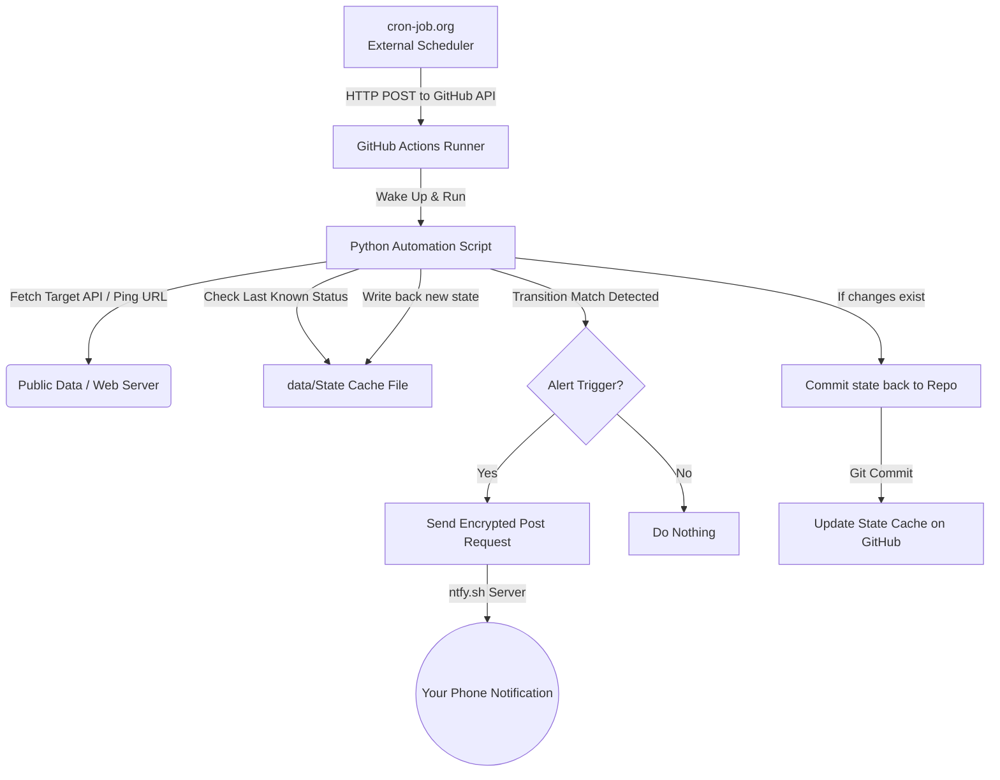

# 🌌 Universal ntfy Automation Command Center

A serverless, 100% cost-free background tracking network running entirely on **GitHub Actions** and **Python**. It monitors public RSS feeds and pings target web services, filtering results, and pushing high-priority, deep-linked push notifications directly to your phone's lock screen using **ntfy.sh**.

---

## 🚀 Active Trackers

| Status Badge | Tracker Name | Target/Feed | Frequency | Criteria |
| :---: | :--- | :--- | :--- | :--- |
| <a href="https://github.com/hariharen9/hh-ntfy/actions/workflows/crackwatch.yml"></a> | **r/CrackWatch Denuvo Tracker** | `/r/CrackWatch` RSS | Every 5 Mins | Flair: `"Denuvo release"` |
| <a href="https://github.com/hariharen9/hh-ntfy/actions/workflows/uptime.yml"></a> | **Multi-Site Uptime Monitor** | 4 Target Websites | Every 15 Mins | State Transition (`UP` ➔ `DOWN` or `DOWN` ➔ `UP`) |
| <a href="https://github.com/hariharen9/hh-ntfy/actions/workflows/package.yml"></a> | **Package Downloads Monitor** | npm, PyPI, VS Code APIs | Daily (02:30 UTC) | Generates download stats digest |
| <a href="https://github.com/hariharen9/hh-ntfy/actions/workflows/weather.yml"></a> | **Daily Weather Monitor** | Open-Meteo API | Daily (07:00 IST / 01:30 UTC) | Pushes morning weather conditions |

---

## 🛠️ Project Architecture Blueprint



---

## ⚙️ Setup & Deployment Guide

To deploy this Command Center to your personal GitHub account, follow these quick steps:

### 1. Configure the Vault Secrets
Since your repository is public to ensure unlimited free workflow runtime, your personal `ntfy` channel names must remain private.
1. Go to your repository on GitHub.
2. Select **Settings** ➔ **Secrets and variables** ➔ **Actions**.
3. Click **New repository secret** for each required token:
   * **Name**: `NTFY_CW_DENUVO_SECRET_LINK`  
     **Secret**: `<your_secret_crackwatch_channel_name>` (e.g. your custom ntfy topic)
   * **Name**: `NTFY_UPTIME_SECRET_LINK`  
     **Secret**: `<your_secret_uptime_channel_name>` (e.g. your custom ntfy topic)

### 2. Enable Repository Write Permissions
For the scheduler to update the local tracking database (`data/crackwatch_seen.txt` and `data/uptime_status.json`), the automation runner requires write permissions.
1. In your repository **Settings**, go to **Actions** ➔ **General**.
2. Scroll down to **Workflow permissions**.
3. Select **Read and write permissions**.
4. Check **Allow GitHub Actions to create and approve pull requests**.
5. Click **Save**.

### 3. Configure External Scheduler (cron-job.org)
Because GitHub Actions' built-in cron scheduler is heavily throttled and delayed on public repositories, we trigger the pipelines instantly with zero delay using the free scheduler **[cron-job.org](https://cron-job.org/)**:

#### Step A: Generate GitHub Personal Access Token (PAT)
1. Go to your GitHub **Settings** ➔ **Developer Settings** ➔ **Personal Access Tokens** ➔ **Fine-grained tokens**.
2. Click **Generate new token** (Name it `Command Center Trigger`).
3. Under **Repository access**, select **Only select repositories** and choose `hh-ntfy`.
4. Under **Permissions**, select **Repository permissions** ➔ **Actions** and set it to **Read and Write**.
5. Click **Generate token** and copy it securely.

#### Step B: Set up cron-job.org Triggers
Sign up for a free account at **[cron-job.org](https://cron-job.org/)** and configure a POST cron job for each active workflow:

* **For CrackWatch Denuvo Tracker:**
  * **URL:** `https://api.github.com/repos/hariharen9/hh-ntfy/actions/workflows/crackwatch.yml/dispatches`
  * **Execution Schedule:** `Every 5 minutes`
  * **Request Method:** `POST`
  * **Headers:**
    * `User-Agent` ➔ `cron-job-trigger`
    * `Accept` ➔ `application/vnd.github+json`
    * `Authorization` ➔ `Bearer <YOUR_GITHUB_PAT>`
  * **Request Body (Raw/JSON):** `{ "ref": "main" }`

* **For Multi-Site Uptime Monitor:**
  * **URL:** `https://api.github.com/repos/hariharen9/hh-ntfy/actions/workflows/uptime.yml/dispatches`
  * **Execution Schedule:** `Every 15 minutes`
  * **Request Method:** `POST`
  * **Headers:** (Same headers as above)
  * **Request Body (Raw/JSON):** `{ "ref": "main" }`

---

## 🔍 Customizing the Uptime Website List

To add, remove, or modify the websites being monitored, open the file [scripts/uptime_monitor.py](file:///e:/Projects/hh-ntfy/scripts/uptime_monitor.py) and update the `WEBSITES` list:

```python
WEBSITES = [
    {"name": "HariHaren Site", "url": "https://hariharen.site"},
    {"name": "Scync Space", "url": "https://scync.space"},
    {"name": "JobTrac Site", "url": "https://jobtrac.site"},
    {"name": "Google", "url": "https://www.google.com"},
    # Add your new site here!
]
```
Save the file and commit it back to your repository. The Uptime Monitor workflow will pick it up on the next 15-minute scheduled run.

---

## 📈 Scalability: Adding a New Tracker

The architecture is designed to act as a **Command Center** for all of your notification tracking pipelines. To add a new automation tracker:

### Step A: Write the Tracker Script
Create a new file in `scripts/` (e.g., `scripts/hardware_deals.py`):
* Make it stateless (reads cached files from `data/your_cache.txt`).
* Use `os.environ.get("NTFY_YOUR_NEW_SECRET")` for the target `ntfy` channel.
* Make it prune historical URLs (e.g., keep the last 150 items).

### Step B: Create a New GitHub Workflow
Create a new file in `.github/workflows/` (e.g., `.github/workflows/deals.yml`):
* Duplicate the `.github/workflows/crackwatch.yml` structure.
* Modify the cron schedules to run as frequently as needed (e.g. `*/10 * * * *`).
* Change the run script target to `python scripts/hardware_deals.py`.
* Map the new vault secret to the environment block.
* Point the automated git commit sequence to add `data/your_cache.txt`.

Both workflows will run completely independently, in isolation, at $0.00 cost under your GitHub Actions free tier limits!
